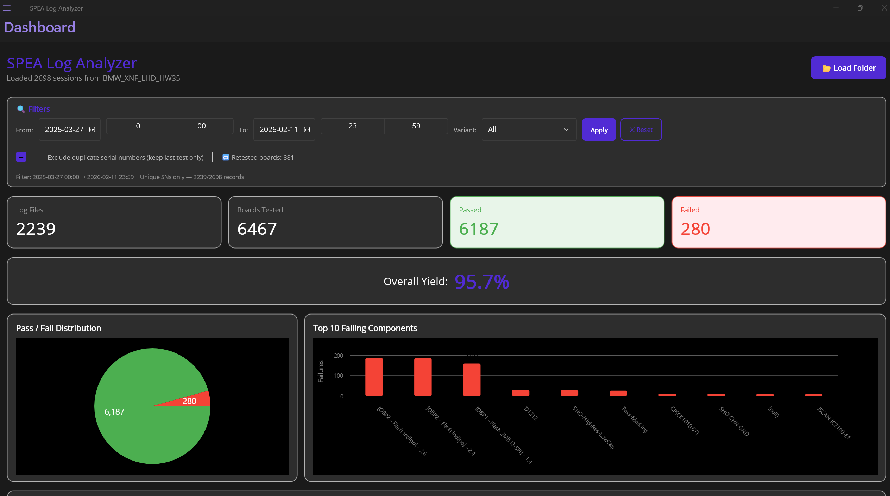
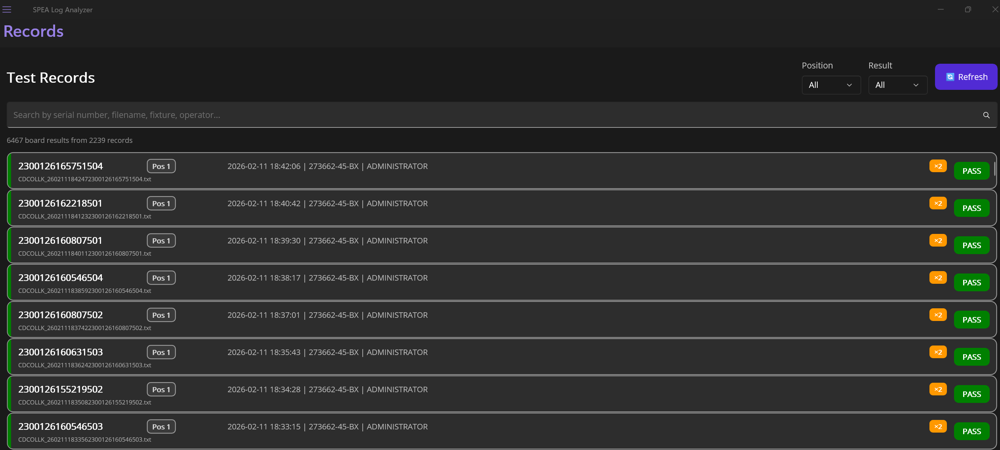
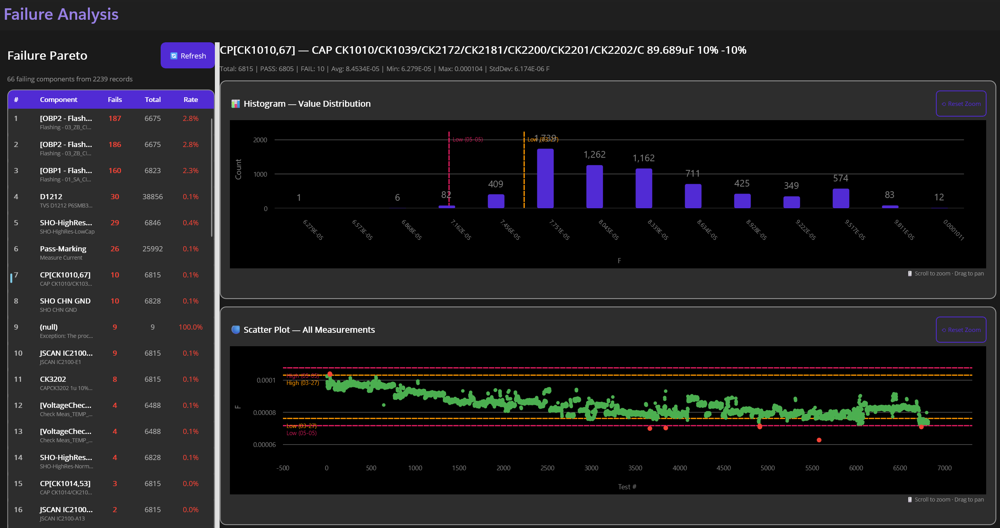

<p align="center">
  
</p>

<h1 align="center">SPEA Log Analyzer</h1>

<p align="center">
  <strong>Desktop application for loading, parsing, and visualizing SPEA automated test equipment (ATE) log files.</strong>
</p>

<p align="center">
  
  
  
  
</p>

---

## 📋 Overview

**SPEA Log Analyzer** is a .NET MAUI desktop application designed for electronics manufacturing engineers and test technicians who work with **SPEA automated test equipment**. It parses the semicolon-delimited `CDCOLLK_*.txt` log files generated by SPEA machines and provides interactive dashboards, filtering, failure analysis, and trend visualization — all in a single native Windows application.

### Key Capabilities

- 📂 **Batch-load** entire folders of SPEA log files (CDCOLLK format)
- 📊 **Dashboard** with yield summary, pass/fail pie chart, Pareto chart, and trend analysis
- 🔍 **Record browsing** with serial number, position, and retest tracking
- ⚠️ **Failure Analysis** with Pareto ranking, histogram, scatter plot, and tolerance change detection
- 🎯 **Smart filtering** by date/time range, variant (fixture), and duplicate serial exclusion
- 📈 **Interactive charts** with zoom/pan and limit line overlays

---

## 🖼️ Screenshots

### Dashboard
> Yield overview, pass/fail distribution, top failing components Pareto, and yield trend over time.



### Dashboard — Filters
> Filter data by date range, time range, variant, and exclude duplicate serial numbers.


### Test Records
> Per-board entries with serial number, position badge, retest indicator, and result color coding.



### Record Detail
> Drill-down into individual test sessions showing all measurements with result, value, and limits.


### Failure Analysis
> Interactive failure Pareto table with histogram and scatter plot. Click any component to visualize.



### Failure Analysis — Tolerance Changes
> Automatic detection of limit changes across sessions, with multi-colored limit lines and history panel.


> **Note:** Replace the placeholder images above with actual screenshots of the running application.  
> Save screenshots to the `docs/screenshots/` folder.

---

## 🏗️ Architecture

```
SpeaLogAnalyzer/
├── Models/                  # Data models
│   ├── TestSession.cs       # Top-level session (one per log file)
│   ├── TestMeasurement.cs   # Individual measurement (ANL/FUNC record)
│   ├── BoardResult.cs       # Per-board result with serial number & retest count
│   ├── SessionBoardEntry.cs # Flattened session+board for list display
│   ├── TestResult.cs        # Enum: Pass, Fail(+), Fail(-), Fail(+/-), None
│   └── TestCategory.cs      # Enum: Analog, Functional
│
├── Services/                # Business logic
│   ├── LogParserService.cs  # CDCOLLK file parser (async, batch, IProgress)
│   └── StatisticsService.cs # Yield, Pareto, trends, retest calculation
│
├── ViewModels/              # MVVM ViewModels (CommunityToolkit.Mvvm)
│   ├── DashboardViewModel.cs        # Summary, charts, filters
│   ├── SessionListViewModel.cs      # Records list with search & filtering
│   ├── SessionDetailViewModel.cs    # Single session drill-down
│   └── FailureAnalysisViewModel.cs  # Failure Pareto, histogram, scatter
│
├── Views/                   # XAML pages
│   ├── DashboardPage.xaml           # Main dashboard
│   ├── SessionListPage.xaml         # Records browser
│   ├── SessionDetailPage.xaml       # Record detail
│   └── FailureAnalysisPage.xaml     # Failure analysis with charts
│
├── Converters/              # XAML value converters
└── Resources/               # Fonts, images, styles, colors
```

### Design Patterns

| Pattern | Implementation |
|---------|---------------|
| **MVVM** | CommunityToolkit.Mvvm with `[ObservableProperty]` and `[RelayCommand]` |
| **Dependency Injection** | Microsoft.Extensions.DependencyInjection via `MauiProgram.cs` |
| **Shell Navigation** | Flyout-based with route registration for detail pages |
| **Async/Await** | Background parsing with `Task.Run` and `IProgress<int>` |

---

## 📦 SPEA Log Format

The application parses **CDCOLLK** format log files produced by SPEA ATE machines:

```
FORMAT;CDCOLLK;V2;...
START;2024-03-25 14:47:52;SITE001;TestProgram;FixtureXNF;OP01
ANL;1;R101;1;0;Resistance Check;PASS;4.7E+03;4.23E+03;5.17E+03;Ohm;0;...;
ANL;1;C201;2;0;Capacitance Test;FAIL(+);1.2E-06;9.0E-07;1.1E-06;F;0;...;
FUNC;2;IC1;3;0;Digital Test;PASS;1;0;1;;0;...;
SN;1;SN001;2;SN002;3;SN003;4;SN004
BOARDRESULT;1;PASS;2;FAIL;3;PASS;4;PASS
END;2024-03-25 14:48:15;PASS
```

**Supported features:**
- Multi-board panels (up to 4 channels/positions)
- Both ANL (analog) and FUNC (functional) record types
- Scientific notation measurement values
- Serial number tracking per board position
- Result types: PASS, FAIL(+), FAIL(-), FAIL(+/-), NONE

---

## 🚀 Getting Started

### Prerequisites

- **Windows 10** (build 17763) or later
- [**.NET 10 SDK**](https://dotnet.microsoft.com/download/dotnet/10.0)
- Visual Studio 2022+ with **.NET MAUI** workload, or VS Code with C# Dev Kit

### Build & Run

```bash
# Clone the repository
git clone https://github.com/Georgi-D-Hristov/SPEA-Log-Analizer.git
cd SPEA-Log-Analizer/SpeaLogAnalyzer

# Build
dotnet build

# Run
dotnet run
```

### Usage

1. Launch the application
2. Click **📁 Load Folder** on the Dashboard
3. Select a folder containing `CDCOLLK_*.txt` log files
4. Explore the **Dashboard** for yield overview
5. Switch to **Records** to browse individual board results
6. Open **Failure Analysis** to investigate top failing components
7. Click any component in the Pareto table to see histogram and scatter plot

---

## 🛠️ Tech Stack

| Technology | Version | Purpose |
|-----------|---------|---------|
| [.NET MAUI](https://dotnet.microsoft.com/apps/maui) | 10.0 | Cross-platform UI framework (Windows target) |
| [LiveCharts2](https://livecharts.dev) | 2.0.0-rc6.1 | Interactive charts (Pie, Column, Line, Scatter) |
| [CommunityToolkit.Mvvm](https://learn.microsoft.com/dotnet/communitytoolkit/mvvm/) | 8.x | MVVM source generators |
| [CommunityToolkit.Maui](https://learn.microsoft.com/dotnet/communitytoolkit/maui/) | 14.0.0 | FolderPicker, converters, behaviors |

---

## ✨ Features in Detail

### 📊 Dashboard
- **Summary cards** — Log Files count, Total Boards, Passed, Failed
- **Yield percentage** — Overall first-pass yield with color indicator
- **Pass/Fail pie chart** — Visual distribution
- **Top 10 Pareto chart** — Most failing components ranked by count
- **Yield trend** — Line chart showing yield % over time (by date)

### 🔍 Filters
- **Date range** — From/To date pickers
- **Time range** — From/To time pickers
- **Variant** — Filter by fixture/variant ID
- **Exclude duplicate serials** — Keep only the latest test per serial number
- **Retested boards counter** — Shows how many boards were retested

### 📋 Test Records
- **Per-board entries** — Each board shown individually (not per session)
- **Serial number** — Bold display with position badge (Pos 1–4)
- **Retest indicator** — Orange badge showing retest count (×2, ×3...)
- **Search** — Filter by serial, filename, fixture, or operator
- **Position filter** — Show only specific board positions
- **Result filter** — Show only PASS or FAIL results

### ⚠️ Failure Analysis
- **Pareto table** — Ranked by fail count with fail rate percentage
- **Histogram** — Value distribution with Sturges' rule binning
- **Scatter plot** — All measurements with PASS (green) / FAIL (red) points
- **Limit lines** — Low/High tolerance lines on both charts
- **Multi-limit detection** — Detects when limits changed across sessions
- **Limit history** — Shows date ranges for each tolerance set
- **Zoom & Pan** — Scroll to zoom, drag to pan, Reset Zoom button
- **Resizable panel** — Drag the splitter to resize the failure table
- **Loading spinner** — ActivityIndicator while analyzing data
- **Auto-refresh** — Analysis starts automatically on first tab visit

---

## 📁 Project Structure

```
SPEA-Log-Analizer/
├── README.md
├── LICENSE                    # MIT License
├── .gitignore
└── SpeaLogAnalyzer/           # .NET MAUI project
    ├── SpeaLogAnalyzer.csproj
    ├── MauiProgram.cs         # DI container & app configuration
    ├── App.xaml               # Application resources & theme
    ├── AppShell.xaml           # Shell navigation (Flyout)
    ├── Models/                # 6 data model classes
    ├── Services/              # Log parser + statistics engine
    ├── ViewModels/            # 4 MVVM ViewModels
    ├── Views/                 # 4 XAML pages
    ├── Converters/            # Value converters
    └── Resources/             # Styles, colors, fonts, images
```

---

## 🤝 Contributing

Contributions are welcome! Feel free to:

1. Fork the repository
2. Create a feature branch (`git checkout -b feature/amazing-feature`)
3. Commit your changes (`git commit -m 'feat: Add amazing feature'`)
4. Push to the branch (`git push origin feature/amazing-feature`)
5. Open a Pull Request

---

## 📄 License

This project is licensed under the **MIT License** — see the [LICENSE](LICENSE) file for details.

---

## 👤 Author

**Georgi Hristov**

- GitHub: [@Georgi-D-Hristov](https://github.com/Georgi-D-Hristov)

---

<p align="center">
  <sub>Built with ❤️ for electronics manufacturing quality engineers</sub>
</p>
